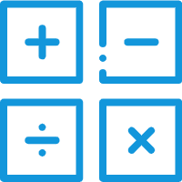

# PSAG2 - 小学生计算题自动生成器

一款面向小学生的计算题出题软件，支持多种题型和难度层次。

## 功能特点

### 基础题型 (Tab 1)
- ✅ 加法 (+)
- ✅ 减法 (-)
- ✅ 乘法 (×)
- ✅ 除法 (÷) - 支持带余数
- ✅ 九九乘法表
- ✅ 比较运算式 (>, <, =)
- ✅ 整数比较

### 高级题型 (Tab 2)
- ✅ 分数运算（加减，自动约分）
- ✅ 小数运算（加减）
- ✅ 四则混合运算（支持括号）
- ✅ 脱式计算（分步显示）
- ✅ 简便运算（乘法分配律、结合律）
- ✅ 应用题（按年级：1-4年级）
- ✅ 单位换算（长度、重量、人民币）
- ✅ 竖式运算

## 环境要求

- Python 3.8+
- Windows / Linux / macOS
- PySide6 >= 6.5.0

## 快速开始

### 1. 克隆项目

```bash
git clone https://github.com/fmangela/PSAG2.git
cd PSAG2
```

### 2. 创建虚拟环境（推荐）

```bash
# Windows
python -m venv venv
venv\Scripts\activate

# Linux/macOS
python3 -m venv venv
source venv/bin/activate
```

### 3. 安装依赖

```bash
pip install -r requirements.txt
```

### 4. 运行程序

```bash
python main.py
```

## Windows 一键安装

双击运行 `setup_windows.bat`，自动完成环境配置。

## 打包为 EXE

```bash
# 确保已安装 pyinstaller
pip install pyinstaller

# 打包
pyinstaller main.spec

# 打包后的可执行文件在 dist/PSAG2.exe
```

## 项目结构

```
PSAG2/
├── main.py              # 主程序入口
├── main.spec            # PyInstaller 打包配置
├── requirements.txt     # Python 依赖
├── setup_windows.bat    # Windows 一键安装脚本
├── demo_advanced.py     # 高级功能演示
├── ui/                  # Qt UI 文件
├── icon/                # 程序图标
└── addons/              # 核心功能模块
    ├── func/
    │   ├── generator.py           # 基础出题器
    │   ├── advanced_generator.py  # 高级出题器
    │   └── method.py              # 工具方法
    ├── io/
    │   └── outputs.py             # 输出模块
    └── operator/
        ├── operation.py           # 基类
        ├── button_operation.py    # Tab 1 操作
        └── button_operation2.py   # Tab 2 操作
```

## 依赖列表

- PySide6 >= 6.5.0 - GUI 框架
- pyinstaller >= 6.0.0 - 打包工具（可选）

## 使用许可证

MIT License

## 预览



---

如有问题，请提交 Issue 或 Pull Request。